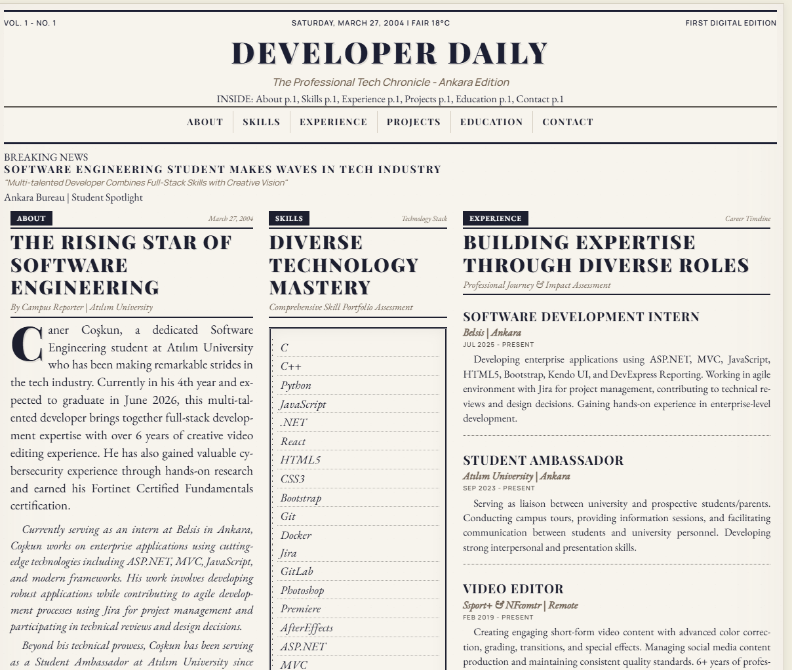

# 📰 Jedkx NewsPaper Portfolio

> A vintage newspaper-themed portfolio showcasing modern software engineering skills

[](https://opensource.org/licenses/MIT)
[](https://reactjs.org/)
[](https://vitejs.dev/)

## 📸 Preview

<div align="center">
  
  <p><em>Authentic 1880s newspaper design meets modern web development</em></p>
</div>

## 🌟 Live Demo

**<a href="https://jedkx.github.io/Jedkx-NewsPaper-Portfolio" target="_blank">Visit Portfolio →</a>**

## 📋 About

Professional portfolio website featuring a vintage newspaper design, built with modern technologies. Showcases my journey as a Software Engineering student and full-stack developer.

### 👨‍💻 Profile
- **Name:** Caner Coşkun
- **Role:** Software Engineering Student & Full-Stack Developer
- **University:** Atılım University (Expected graduation: June 2026)
- **Current Position:** Software Engineering Intern at Belsis
- **Experience:** 6+ years in video editing, cybersecurity certified

## 🚀 Features

- **🎨 Vintage Newspaper Design** - Authentic 1880s newspaper aesthetic
- **📱 Fully Responsive** - Optimized for all devices
- **⚡ High Performance** - Optimized build and loading
- **🔍 SEO Optimized** - Complete meta tags and Open Graph
- **♿ Accessible** - Semantic HTML structure
- **🎯 Production Ready** - Optimized for deployment

## 🛠️ Tech Stack

- **React 19** - UI Library
- **Vite 7** - Build Tool & Dev Server
- **Modern CSS** - Custom properties, Grid, Flexbox
- **ESLint** - Code Quality

## 🏃‍♂️ Quick Start

```bash
# Clone repository
git clone https://github.com/jedkx/Jedkx-NewsPaper-Portfolio.git
cd Jedkx-NewsPaper-Portfolio

# Install dependencies
npm install

# Start development server
npm run dev
```

Visit: http://localhost:3000

## 📦 Scripts

```bash
npm run dev        # Start development server
npm run build      # Build for production
npm run preview    # Preview production build
npm run lint       # Check code quality
npm run lint:fix   # Fix linting issues
```

## 🚀 Deployment to GitHub Pages

### Step 1: Create GitHub Repository
1. Go to [GitHub](https://github.com/jedkx) and create a new repository: `Jedkx-NewsPaper-Portfolio`
2. Make it **public**

### Step 2: Upload Code
```bash
# Navigate to your project
cd "your-project-folder"

# Initialize git
git init
git add .
git commit -m "Initial commit: Vintage newspaper portfolio"

# Connect to GitHub
git remote add origin https://github.com/jedkx/Jedkx-NewsPaper-Portfolio.git
git branch -M main
git push -u origin main
```

### Step 3: Enable GitHub Pages
1. Go to repository **Settings**
2. Click **Pages** section
3. Under **Source**, select **"Deploy from a branch"**
4. Choose **"main"** branch and **"/ (root)"** folder
5. Click **Save**

### Step 4: Build & Deploy
```bash
npm run build
```

Your site will be live at: **https://jedkx.github.io/Jedkx-NewsPaper-Portfolio**

> Takes 5-10 minutes to deploy after pushing to GitHub

## 📁 Project Structure

```
src/
├── assets/              # Images, icons
├── components/          # React components
├── styles/             # CSS files
│   ├── newspaper.css   # Main theme
│   ├── typography.css  # Typography
│   └── layout.css      # Layout utilities
├── App.jsx             # Main component
└── main.jsx           # Entry point
```

## 🎨 Customization

### Colors
Edit CSS variables in `src/styles/newspaper.css`:
```css
:root {
  --color-primary: #2C1810;
  --color-gold: #D4AF37;
  --color-paper: #F5F1E8;
}
```

### Content
Update content in `src/App.jsx` - all portfolio information is in this single file.

## 📊 Performance

- **Lightweight** - < 500KB total size
- **Fast Loading** - Optimized assets
- **Mobile Friendly** - Responsive design
- **SEO Ready** - Meta tags included

## 🔧 Browser Support

- Chrome/Edge 88+
- Firefox 85+
- Safari 14+
- Mobile browsers

## 📞 Contact

**Caner Coşkun**
- Portfolio: [jedkx.github.io/Jedkx-NewsPaper-Portfolio](https://jedkx.github.io/Jedkx-NewsPaper-Portfolio)
- GitHub: [@jedkx](https://github.com/jedkx)
- Email: ccoskun742@gmail.com

## 📄 License

MIT License - see [LICENSE](LICENSE) file for details.

---

⭐ **Star this repository if you found it helpful!**
